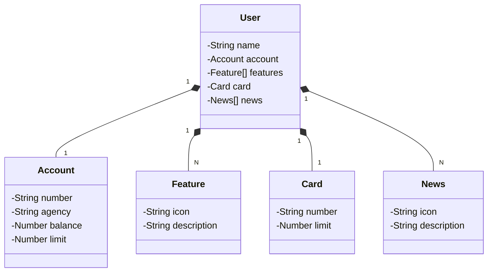

# Publishing an API REST on Cloud Using Spring Boot 3, Java, and Railway

## Instructions

## Technologies Used
- Java
- Spring Boot 3
  - Spring Web
  - Spring Data JPA
- Railway (PostgreSQL e CI/CD for API) 

## Class Diagram
